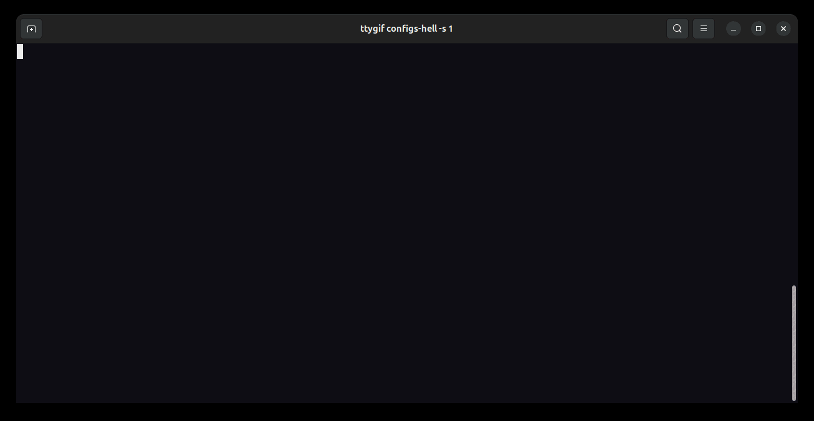

## configs-hell

Easily initialize starting configuaration for your nodejs project.



## Installation

Install configs-hell with npm

```bash
  npm i -g configs-hell
```

## Run

```bash
  configs-hell init
```

thanks !
